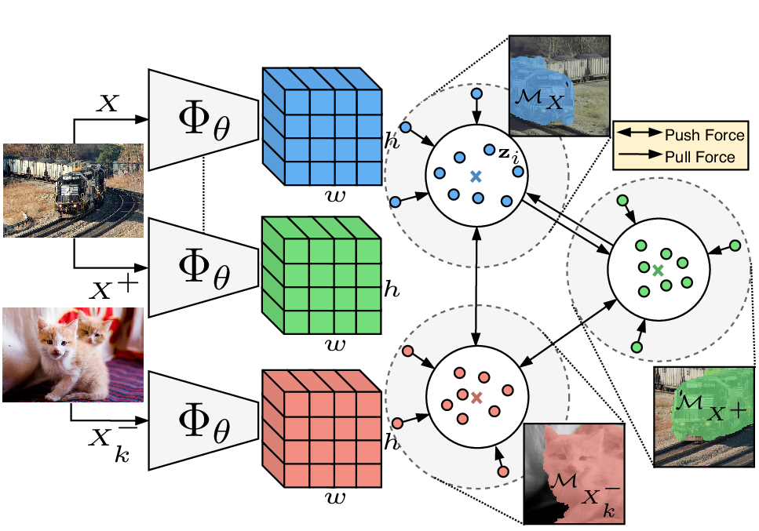
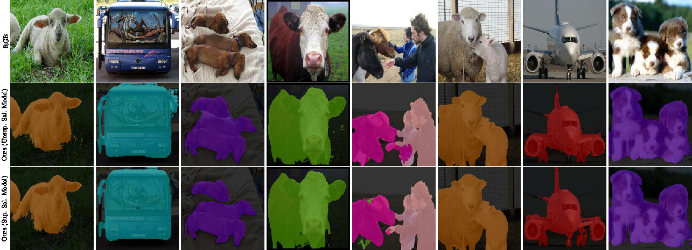

# Unsupervised Semantic Segmentation by Contrasting Object Mask Proposals

This repo contains the Pytorch implementation of our paper:
> [**Unsupervised Semantic Segmentation by Contrasting Object Mask Proposals**](https://arxiv.org/pdf/2102.06191.pdf)
>
> [Wouter Van Gansbeke](https://twitter.com/WGansbeke), [Simon Vandenhende](https://twitter.com/svandenh1), [Stamatios Georgoulis](https://twitter.com/stam_g), and [Luc Van Gool](https://ee.ethz.ch/the-department/faculty/professors/person-detail.OTAyMzM=.TGlzdC80MTEsMTA1ODA0MjU5.html).

- __Accepted at ICCV 2021 ([Slides]()).__
- 🏆 __SOTA for unsupervised semantic segmentation.__ 
- __Check out [Papers With Code](https://paperswithcode.com/paper/unsupervised-semantic-segmentation-by) for the [Unsupervised Semantic Segmentation](https://paperswithcode.com/sota/unsupervised-semantic-segmentation-on-pascal-1?p=unsupervised-semantic-segmentation-by) benchmark and more details.__
<p align="left">
    

[](https://paperswithcode.com/sota/unsupervised-semantic-segmentation-on-pascal-1?p=unsupervised-semantic-segmentation-by) 

## Contents
1. [Introduction](#introduction)
0. [Installation](#installation)
0. [Training MaskContrast](#training-maskcontrast)
    - [Setup](#setup)
    - [Train](#pre-train-model)
0. [Evaluation](#evaluation)
    - [Linear Classifier](#linear-classifier-lc)
    - [Clustering](#clustering-k-means)
    - [Semantic Segment Retrieval](#semantic-segment-retrieval)
0. [Model Zoo](#model-zoo)
0. [Citation](#citation)

## Introduction
Being able to learn dense semantic representations of images without supervision is an important problem in computer vision. However, despite its significance, this problem remains rather unexplored, with a few exceptions that considered unsupervised semantic segmentation on small-scale datasets with a narrow visual domain. We make a first attempt to tackle the problem on datasets that have been traditionally utilized for the supervised case (e.g. PASCAL VOC). To achieve this, we introduce a novel two-step framework that adopts a predetermined prior in a contrastive optimization objective to learn pixel embeddings.
Additionally, we argue about the importance of having a prior that contains information about objects, or their parts, and discuss several possibilities to obtain such a prior in an unsupervised manner. In particular, we adopt a mid-level visual prior to group pixels together and contrast the obtained object mask porposals. For this reason we name the method __MaskContrast__. 

## Installation
The Python code runs with recent Pytorch versions, e.g. 1.4. 
Assuming [Anaconda](https://docs.anaconda.com/anaconda/install/), the most important packages can be installed as:
```shell
conda install pytorch=1.4.0 torchvision=0.5.0 cudatoolkit=10.0 -c pytorch
conda install -c conda-forge opencv           # For image transformations
conda install matplotlib scipy scikit-learn   # For evaluation
conda install pyyaml easydict                 # For using config files
conda install termcolor                       # For colored print statements
```
We refer to the `requirements.txt` file for an overview of the packages in the environment we used to produce our results.
The code was run on 2 Tesla V100 GPUs. 

## Training MaskContrast

### Setup
The PASCAL VOC [dataset](https://drive.google.com/file/d/1pxhY5vsLwXuz6UHZVUKhtb7EJdCg2kuH/view?usp=sharing) will be downloaded automatically when running the code for the first time. The dataset includes the precomputed supervised and unsupervised saliency masks, following the implementation from the paper. 

The following files (in the `pretrain/` and `segmentation/` directories) need to be adapted in order to run the code on your own machine:
- Change the file path for the datasets in `data/util/mypath.py`. The PASCAL VOC dataset will be saved to this path.
- Specify the output directory in `configs/env.yml`. All results will be stored under this directory. 

### Pre-train model
The training procedure consists of two steps. First, pixels are grouped together based upon a mid-level visual prior (saliency is used). Then, a pre-training strategy is proposed to contrast the pixel-embeddings of the obtained object masks. The code for the pre-training can be found in the `pretrain/` directory and the configuration files are located in the `pretrain/configs/` directory. You can choose to run the model with the masks from the supervised or unsupervised saliency model.
For example, run the following command to perform the pre-training step on PASCAL VOC with the supervised saliency model:
```shell
cd pretrain
python main.py --config_env configs/env.yml --config_exp configs/VOCSegmentation_supervised_saliency_model.yml
```

## Evaluation
### Linear Classifier (LC)
We freeze the weights of the pre-trained model and train a 1 x 1 convolutional layer to predict the class assignments from the generated feature representations. Since the discriminative power of a linear classifier is low, the pixel embeddings need to be informative of the semantic class to solve the task in this way. To train the classifier run the following command:
```shell
cd segmentation
python linear_finetune.py --config_env configs/env.yml --config_exp configs/linear_finetune/linear_finetune_VOCSegmentation_supervised_saliency.yml
```
Note, make sure that the `pretraining` variable in `linear_finetune_VOCSegmentation_supervised_saliency.yml` points to the location of your pre-trained model.
You should get the following results:
```
mIoU is 63.95
IoU class background is 90.95
IoU class aeroplane is 83.78
IoU class bicycle is 30.66
IoU class bird is 78.79
IoU class boat is 64.57
IoU class bottle is 67.31
IoU class bus is 84.24
IoU class car is 76.77
IoU class cat is 79.10
IoU class chair is 21.24
IoU class cow is 66.45
IoU class diningtable is 46.63
IoU class dog is 73.25
IoU class horse is 62.61
IoU class motorbike is 69.66
IoU class person is 72.30
IoU class pottedplant is 40.15
IoU class sheep is 74.70
IoU class sofa is 30.43
IoU class train is 74.67
IoU class tvmonitor is 54.66
```
Unsurprisingly, the model has not learned a good representation for every class since some classes are hard to distinguish, e.g. `chair` or `sofa`.

We visualize a few examples after CRF post-processing below.
<p align="left">
    

### Clustering (K-means)
The feature representations are clustered with K-means. If the pixel embeddings are disentangled according to the defined class labels, we can match the predicted clusters with the ground-truth classes using the Hungarian matching algorithm. 


```shell
cd segmentation
python kmeans.py --config_env configs/env.yml --config_exp configs/kmeans/kmeans_VOCSegmentation_supervised_saliency.yml
```
Remarks: Note that we perform the complete K-means fitting on the validation set to save memory and that the reported results were averaged over 5 different runs. 
You should get the following results (21 clusters):
```
IoU class background is 88.17
IoU class aeroplane is 77.41
IoU class bicycle is 26.18
IoU class bird is 68.27
IoU class boat is 47.89
IoU class bottle is 56.99
IoU class bus is 80.63
IoU class car is 66.80
IoU class cat is 46.13
IoU class chair is 0.73
IoU class cow is 0.10
IoU class diningtable is 0.57
IoU class dog is 35.93
IoU class horse is 48.68
IoU class motorbike is 60.60
IoU class person is 32.24
IoU class pottedplant is 23.88
IoU class sheep is 36.76
IoU class sofa is 26.85
IoU class train is 69.90
IoU class tvmonitor is 27.56
```

### Semantic Segment Retrieval
We examine our representations on PASCAL through segment retrieval. First, we compute a feature vector for every object mask in the `val` set by averaging the pixel embeddings within the predicted mask. Next, we retrieve the nearest neighbors on the `train_aug` set for each object.

```shell
cd segmentation
python retrieval.py --config_env configs/env.yml --config_exp configs/retrieval/retrieval_VOCSegmentation_unsupervised_saliency.yml
```

| Method                    | MIoU (7 classes) | MIoU (21 classes)|
| ------------------------- | ---------------- | ---------------- |
| MoCo v2                   | 48.0             | 39.0             |
| MaskContrast* (unsup sal.)| 53.4             | 43.3             |
| MaskContrast* (sup sal.)  | 62.3             | 49.6             |

_\* Denotes MoCo init._


## Model Zoo
Download the pretrained and linear finetuned models here.

| Dataset            | Pixel Grouping Prior    | mIoU (LC)     | mIoU (K-means)   |Download link |
|------------------  | ----------------------  |---------------|---------  |--------------|
| PASCAL VOC         |  Supervised Saliency    |   -           |   44.2    |[Pretrained Model 🔗](https://drive.google.com/file/d/1UkzAZMBG1U8kTqO3yhO2nTtoRNtEvyRq/view?usp=sharing) | 
| PASCAL VOC         |  Supervised Saliency    |   63.9 (65.5*)  |   44.2    |[Linear Finetuned 🔗](https://drive.google.com/file/d/1C2iv8wFV8MNLYLKw2E0Do2aeO-eaWNw3/view?usp=sharing)  |
| PASCAL VOC         |  Unsupervised Saliency   |   -           |  35.0     |[Pretrained Model 🔗](https://drive.google.com/file/d/1efL1vWVcrGAqeC6OLalX8pwec41c6NZj/view?usp=sharing) |
| PASCAL VOC         |  Unsupervised Saliency   |   58.4 (59.5*) |  35.0     |[Linear Finetuned 🔗](https://drive.google.com/file/d/1y-HZTHHTyAceiFDLAraLXooGOdyQqY2Z/view?usp=sharing)  |

_\* Denotes CRF post-processing._

To evaluate and visualize the predictions of the finetuned model, run the following command:
```shell
cd segmentation
python eval.py --config_env configs/env.yml --config_exp configs/linear_finetune/linear_finetune_VOCSegmentation_supervised_saliency.yml --state-dict $PATH_TO_MODEL
```
You can optionally append the `--crf-postprocess` flag. 


## Citation
This code is based on the [SCAN](https://github.com/wvangansbeke/Unsupervised-Classification) and [MoCo](https://github.com/facebookresearch/moco) repositories.
If you find this repository useful for your research, please consider citing the following paper(s):

```bibtex
@article{vangansbeke2020unsupervised,
  title={Unsupervised Semantic Segmentation by Contrasting Object Mask Proposals},
  author={Van Gansbeke, Wouter and Vandenhende, Simon and Georgoulis, Stamatios and Van Gool, Luc},
  journal={arxiv preprint arxiv:2102.06191},
  year={2021}
}
@inproceedings{vangansbeke2020scan,
  title={Scan: Learning to classify images without labels},
  author={Van Gansbeke, Wouter and Vandenhende, Simon and Georgoulis, Stamatios and Proesmans, Marc and Van Gool, Luc},
  booktitle={Proceedings of the European Conference on Computer Vision},
  year={2020}
}
@inproceedings{he2019moco,
  title={Momentum Contrast for Unsupervised Visual Representation Learning},
  author={Kaiming He and Haoqi Fan and Yuxin Wu and Saining Xie and Ross Girshick},
  booktitle = {Conference on Computer Vision and Pattern Recognition},
  year={2019}
}
```
For any enquiries, please contact the main authors.

For an overview on self-supervised learning, have a look at the [overview repository](https://github.com/wvangansbeke/Self-Supervised-Learning-Overview).

## License

This software is released under a creative commons license which allows for personal and research use only. For a commercial license please contact the authors. You can view a license summary [here](http://creativecommons.org/licenses/by-nc/4.0/).

## Acknoledgements
This work was supported by Toyota, and was carried out at the TRACE Lab at KU Leuven (Toyota Research on Automated Cars in Europe - Leuven).
